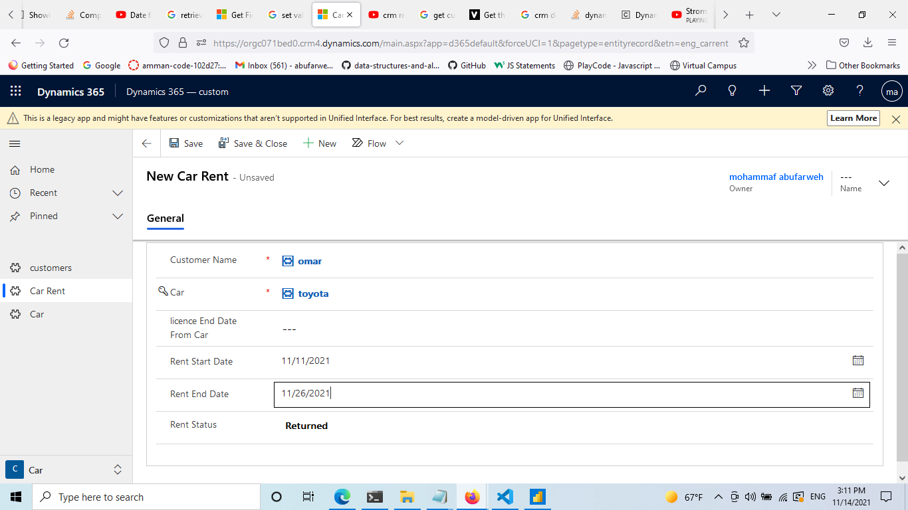
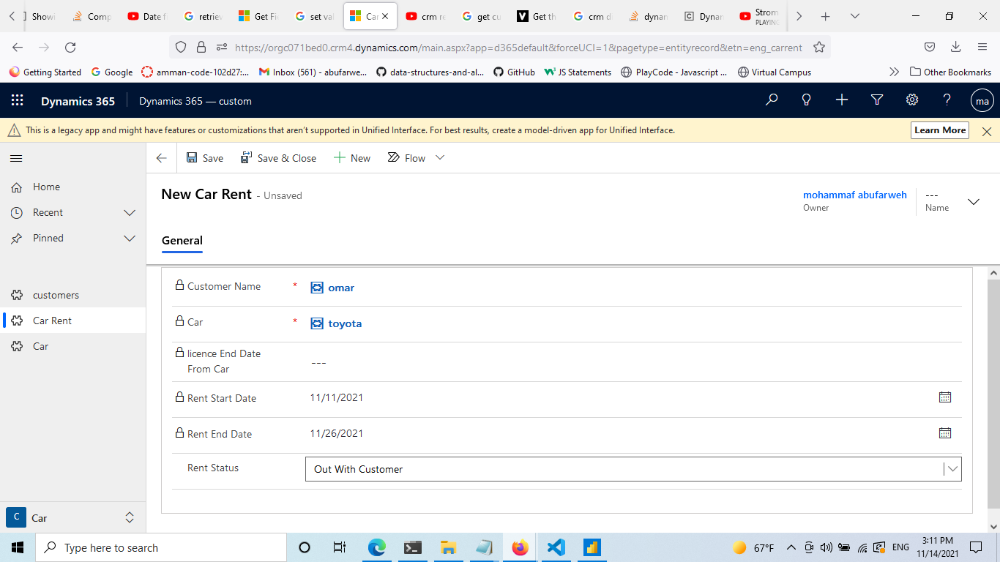

## Rent Status Control 

**- Functions Description:**

 

- Disableform(): A function to disable all form fields ( set all fields to readonly )
- CheckRentStatus(): When the status is out with customer . You should disable all form fields by calling function DisableForm(). Otherwise, the form is editable again

 
- Disableform():

```js
function Disableform()
{
 var form = Xrm.Page.ui.controls.get();
 for (var i in form) 
 {
  var c = form[i];
  if (c.getName() != "" && c.getName() != null) 
  {
   if (!c.getDisabled()) {c.setDisabled(true);}
  }
 }
}
```






```js
function CheckRentStatus(context){
let carRentForm = context.getFormContext();
let rentStatus= carRentForm.getAttribute("eng_rentstatus").getValue();
if(rentStatus == false){
    var form = Xrm.Page.ui.controls.get();
    for (var i in form) 
    {
     var c = form[i];
     if (c.getName() != "" && c.getName() != null) 
     {
      if (!c.getDisabled()) {c.setDisabled(true);}
     }
    }
    let rentStatusControl = carRentForm.getControl("eng_rentstatus");
    rentStatusControl.setDisabled(false);
    return;
}
if(rentStatus == true){
    var form = Xrm.Page.ui.controls.get();
    for (var i in form) 
    {
     var c = form[i];
     if (c.getName() != "" && c.getName() != null) 
     {
      if (c.getDisabled()) {c.setDisabled(false);}
     }
    }

}
}
```