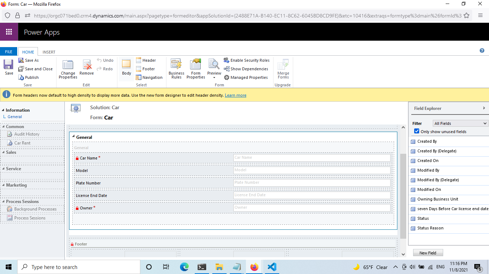

# Car Assignment 


## entities’ forms

- Car 



- Car Rent 


- Customer


## security roles


- Receptionist


- Manager


## Work Flow For Reminder Email


## Work Flow For same car can’t have two renting requests at the same time 


## Duplicate detection rule


##  JavaScript codes for current Date

```js
function PrintName()
{
var Vendor = Xrm.Page.getAttribute("new_printvendor").getValue();
var BRE = Xrm.Page.getAttribute("new_bre").getText();
var Invoice = Xrm.Page.getAttribute("new_invoicetemplate").getText();
var Batch = Xrm.Page.getAttribute("new_printbatch").getValue();
var Pages = Xrm.Page.getAttribute("new_printfileofpages").getValue();
var Name = Xrm.Page.getAttribute("new_printfilename").getValue();
if (BRE != null && Invoice != null && Batch != null && Pages != null && Name == null) {
var d = Date.now();
var PrintMonth = d.getMonth();
var PrintDay = d.getDay();
var PrintYear = d.getFullYear();
}
if (Vendor == 100000001) {
Xrm.Page.getAttribute("new_printfilename").setValue( "Multifam" + "_" + Invoice + "_" + PrintMonth + "." + PrintDay + "." + PrintYear + "_" + Pages + "_" + BRE + "_" + Batch);
}
if (Vendor == 100000000) {
Xrm.Page.getAttribute("new_printfilename").setValue( "Multifam" + "_" + PrintMonth + "." + PrintDay + "." + PrintYear + "_" + "BillOnly" + Invoice + "_" + Batch + "_" + Pages);
}
if (BRE == 100000000 && Vendor == 100000000) {
Xrm.Page.getAttribute("new_printfilename").setValue( "Multifam" + "_" + PrintMonth + "." + PrintDay + "." + PrintYear + "_" + Invoice + "_" + Batch + "_" + Pages);
}
}

```

## Rent end date can’t be before start date 


## Car license end date must be at least 7 days before the rent end date

Create Feild Seven Days Before License end date 


- Work Flow to maintain Car license end date must be at least 7 days before the rent end date


##  An exported solution for the developed system 

- Used CRM version : 1.0.0.0
- CRM version  2018


## Report filter criteria and the result


