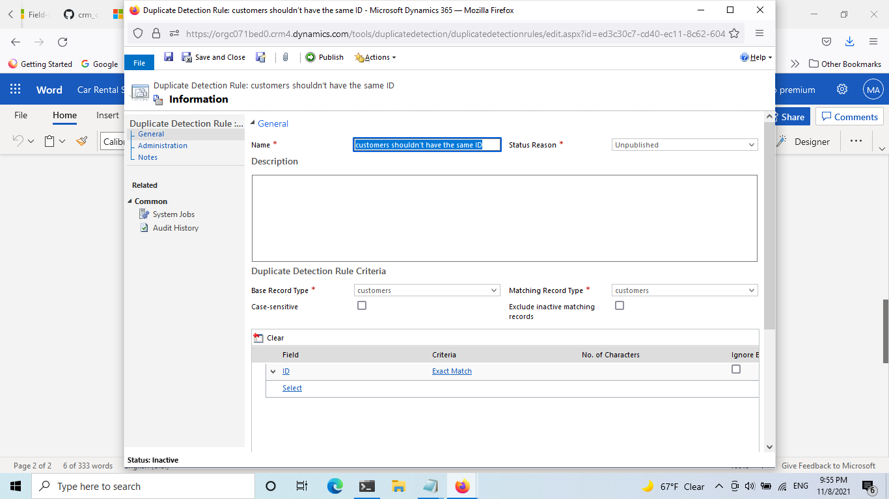
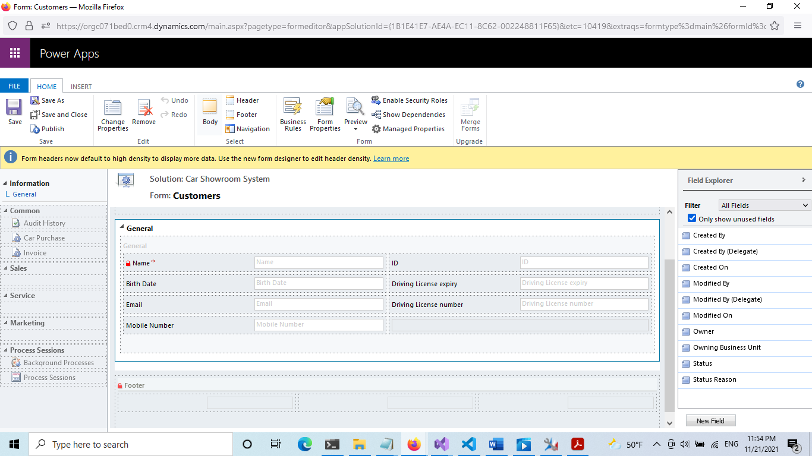
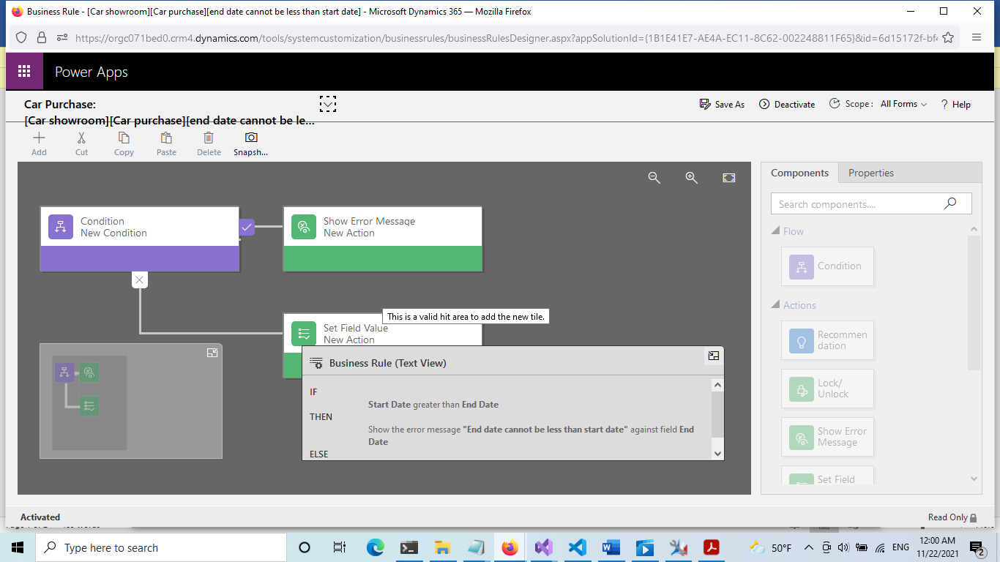

# Final Assignment

## Plugin 


```c#
using System;
using System.Collections.Generic;
using System.Linq;
using System.Text;
using System.Threading.Tasks;
using Microsoft.Xrm.Sdk;
using Microsoft.Xrm.Sdk.Query;

namespace ClassLibrary3
{
    public class Class1 : IPlugin

    {
        public void Execute(IServiceProvider serviceProvider)
        {
            ITracingService Mytrace = (ITracingService)serviceProvider.GetService(typeof(ITracingService));
            IExecutionContext context = (IExecutionContext)serviceProvider.GetService(typeof(IExecutionContext));

            IOrganizationServiceFactory serviceFactory = (IOrganizationServiceFactory)serviceProvider.GetService(typeof(IOrganizationServiceFactory));
            IOrganizationService service = serviceFactory.CreateOrganizationService(context.UserId);

            if (context.InputParameters.Contains("Target") &&
               context.InputParameters["Target"] is Entity)
            {

                if (context.Depth > 2)
                    return;
                Mytrace.Trace("1");
                Entity eng_carpurchase = (Entity)context.InputParameters["Target"];
                 
                if (eng_carpurchase.LogicalName == "eng_carpurchase")
                {
                    if (context.MessageName.ToLower() == "create" || context.MessageName.ToLower() == "update")
                    {
                        Entity Invoice = new Entity("eng_invoice");
                        Mytrace.Trace("2");
                        var cols = new ColumnSet(
                        new String[] { "eng_car", "eng_customer", "eng_paymentmethod", "eng_startdate", "eng_enddatee", "eng_differentmonth" , "eng_carpriceee" });
                        eng_carpurchase= service.Retrieve("eng_carpurchase", eng_carpurchase.Id, cols);

                        Mytrace.Trace("2");
                       
                            
                            Invoice["eng_carpurchase"] = eng_carpurchase.ToEntityReference();
                            Invoice["eng_car"] = eng_carpurchase["eng_car"];
                            Invoice["eng_customer"] = eng_carpurchase["eng_customer"];
                            Invoice["eng_paymentmethod"] = eng_carpurchase["eng_paymentmethod"];
                            Invoice["eng_amount"] = eng_carpurchase["eng_carpriceee"];

                            Invoice["eng_retriveduffrenetdate"] = eng_carpurchase["eng_differentmonth"];
                            

                            Mytrace.Trace("5");

                          Guid id =  service.Create(Invoice);

                        
                        

                        
                            if (eng_carpurchase["eng_startdate"] != null && eng_carpurchase["eng_enddatee"] != null)
                            {
                                Mytrace.Trace("n");
                                 var cols2 = new ColumnSet(
                                 new String[] { "eng_name", "eng_customer", "eng_retriveduffrenetdate", "eng_retriveduffrenetdate", "eng_amount", "eng_invoicestatus" });
                                   Invoice = service.Retrieve("eng_invoice", id, cols2);
                                Mytrace.Trace("nttt");
                                Entity InvoiceDetail = new Entity("eng_invoicedetails");

                            
                            for (int iii = 0; iii < (int)eng_carpurchase["eng_differentmonth"]; iii++)
                                    {
                                    Mytrace.Trace("mmmm");

                              //  InvoiceDetail["eng_name"] = new EntityReference("eng_invoice", id);
                               // InvoiceDetail["eng_name"] = Invoice["eng_name"];
                                    Mytrace.Trace("mmmm");
                                     InvoiceDetail["eng_amount"] = eng_carpurchase["eng_carpriceee"];
                                   InvoiceDetail["eng_ivoicee"] = Invoice.ToEntityReference();
                                InvoiceDetail["eng_status"] = Invoice["eng_invoicestatus"];
                                service.Create(InvoiceDetail);
                                    Mytrace.Trace("mmmm");

                              
                            }

                           

                            }

                        


                    
                    }
                }
            }
        }    
    }
}
```


```c#
using System;
using System.Collections.Generic;
using System.Linq;
using System.Text;
using System.Threading.Tasks;
using Microsoft.Xrm.Sdk;
using Microsoft.Xrm.Sdk.Query;

namespace ClassLibrary4
{
    public class Class1 : IPlugin
    {
        public void Execute(IServiceProvider serviceProvider)
        {
            ITracingService Mytrace = (ITracingService)serviceProvider.GetService(typeof(ITracingService));
            IExecutionContext context = (IExecutionContext)serviceProvider.GetService(typeof(IExecutionContext));

            IOrganizationServiceFactory serviceFactory = (IOrganizationServiceFactory)serviceProvider.GetService(typeof(IOrganizationServiceFactory));
            IOrganizationService service = serviceFactory.CreateOrganizationService(context.UserId);

            if (context.InputParameters.Contains("Target") &&
               context.InputParameters["Target"] is Entity)
            {

                if (context.Depth > 2)
                    return;
                Mytrace.Trace("1");
                Entity eng_invoice = (Entity)context.InputParameters["Target"];

                if (eng_invoice.LogicalName == "eng_invoice")
                {
                    if (context.MessageName.ToLower() == "create" || context.MessageName.ToLower() == "update")
                    {

                  

                        Entity eng_invoicestatus = new Entity("eng_invoicestatus");
                        eng_invoice["eng_invoicestatus"] = eng_invoicestatus["eng_status"]  ;
                        service.Update(eng_invoicestatus); 
                    }
                }
            }
        }
    }
}
```


## JavaScript


```js
function TickerChange() {
    if(Xrm.Page.getAttribute("eng_paymentmethod").getValue() == true) {
        Xrm.Page.getControl("eng_enddatee").setVisible(true);
        Xrm.Page.getControl("eng_startdate").setVisible(true);
    }
    else {
        Xrm.Page.getControl("eng_enddatee").setVisible(false);
        Xrm.Page.getControl("eng_startdate").setVisible(false);
    }
 }

 function car_Purchase(date){

    let carForm = date.getFormContext();
    let nameCar = carForm.getAttribute("eng_car").getValue();
    let nameCustomer = carForm.getAttribute("eng_customer").getValue();
if(nameCar!= null && nameCustomer!=null){
    console.log(nameCustomer[0]);
    Xrm.Page.getAttribute ("eng_name"). setValue (nameCar[0].name + " Purchase to Customer " + nameCustomer[0].name );
}
 }


 function subject(data){
    let carForm = data.getFormContext();
    let sub = carForm.getAttribute("eng_customer").getValue();
    Xrm.Page.getAttribute ("eng_name").setValue(" Invoice for "+sub[0].name);

 }
```











