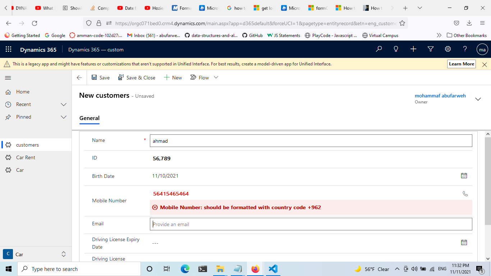
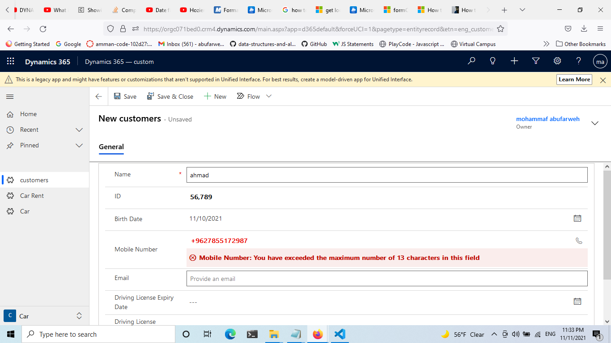
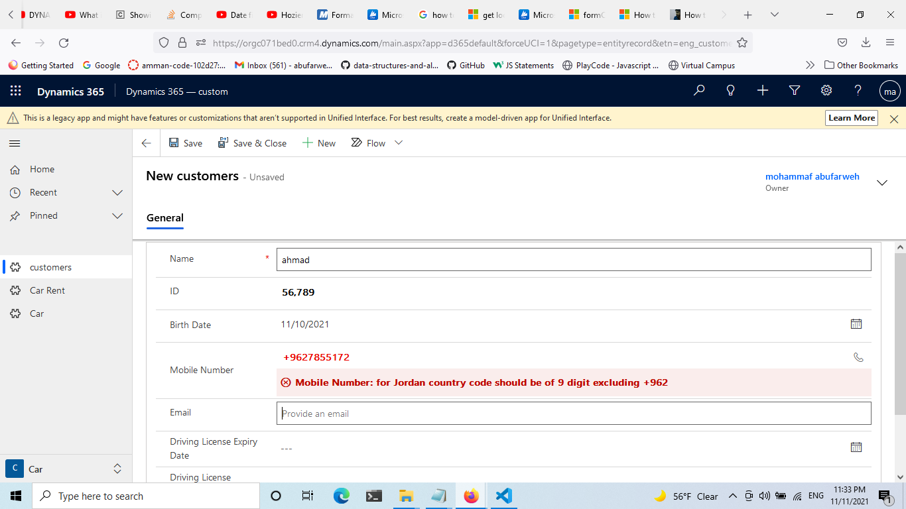
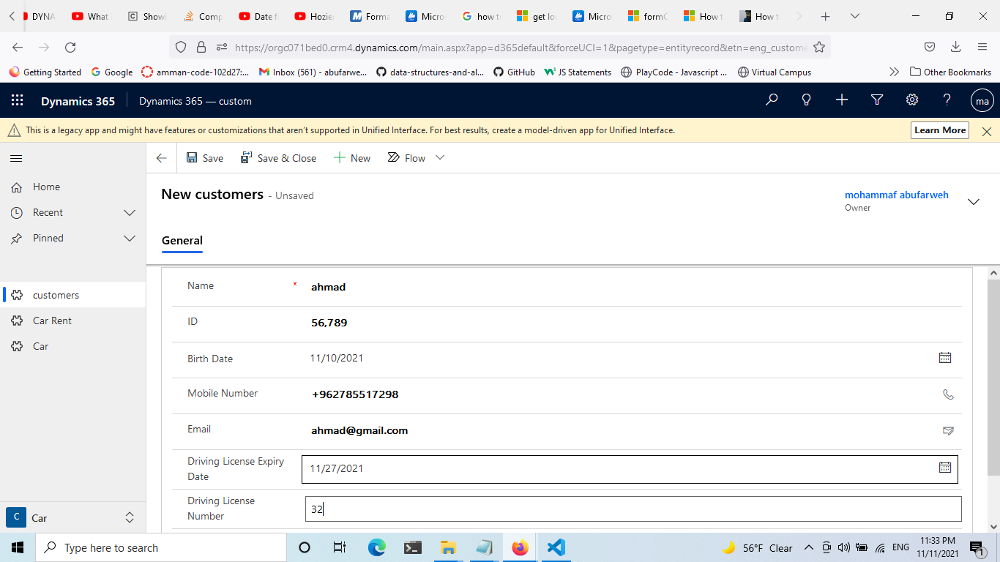
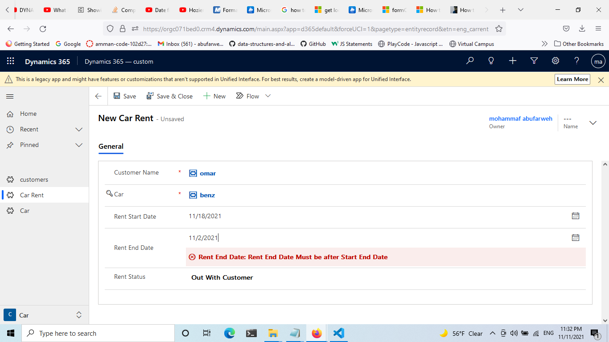

# Assignment 7

- required to do the following function:

1. ValidationDate()

2. MobileNumberValidation()

3. RetrieveCarLicenseEndDate() - Bonus


### Functions Description:

-  ValidateDate: You’re required to validate that the rent end date is greater than or equal to rent start date. This will be on the rent entity
-  MobileNumberalidation: You’re required to validate that the mobile number field on the customer should start with the country code ( Jordan ) & its digits should be 11 ( not less than nor greater than )
-  RetrieveCarLicenseEndDate: retrieve the car license end date from the car lookup in the rent form

### MobileNumberalidation












```js
function phoneVal (executionContext)
{
let formContext = executionContext.getFormContext();
let phoneFeild = formContext.getAttribute("eng_mobilenumber").getValue();

if (phoneFeild != null) {
    if (phoneFeild.substr(0, 1) != '+') {
        formContext.getControl("eng_mobilenumber").clearNotification("BDATE");
        formContext.getControl("eng_mobilenumber").setNotification( "should be formatted with country code +962","BDATE");
        return;
    }
    else {
        if (phoneFeild.substr(0, 4) == '+962') {
            if (phoneFeild.length != 13) {
                formContext.getControl("eng_mobilenumber").clearNotification("BDATE");
                formContext.getControl("eng_mobilenumber").setNotification(" for Jordan country code should be of 9 digit excluding +962" ,"BDATE");
                return;
            }
        }
        else {
            if (phoneFeild.length < 13) {
                formContext.getControl("eng_mobilenumber").clearNotification("BDATE");
                formContext.getControl("eng_mobilenumber").setNotification( " seems to be too short" ,"BDATE");
                return;
            }
        }
    }
    formContext.getControl("eng_mobilenumber").clearNotification();
}
}
```
## ValidateDate




```js
function validationDate(date) 
{
    // target Rent car form
    let carForm = date.getFormContext();
    
    // target feild rent end date

    let rentEndDate = carForm.getAttribute("eng_rentenddate").getValue();

    // target feild rent start date 

    let rentStartDate = carForm.getAttribute("eng_rentstartdate").getValue();

    let rentEndDateControl = carForm.getControl("eng_rentenddate")
if (rentEndDate.getTime() < rentStartDate.getTime()){
rentEndDateControl.setNotification("Rent End Date Must be after Start End Date","BDATE")
}else{rentEndDateControl.clearNotification("BDATE")

}

}
```

## RetrieveCarLicenseEndDate

- this will Retrieve only the name of the car 


```js
function getCarDetails(){

    
    if (Xrm.Page.data.entity.attributes.get("eng_car").getValue() != null) {

        let CustomerId = Xrm.Page.data.entity.attributes.get("eng_car").getValue()[0].id;

        let CustomerName = Xrm.Page.data.entity.attributes.get("eng_car").getValue()[0].name;

        let CustomerType = Xrm.Page.data.entity.attributes.get("eng_car").getValue()[0].entityType;
        alert(CustomerName);

    }


    }
```