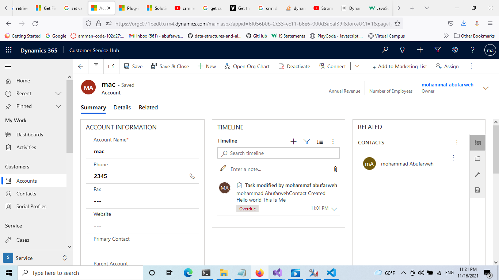

# Assignmet 8

- You’re required to develop a plugin that meets the below requirement:

- When creating an account, you should do the following:

**1. Create a contact associated to it. Ex: when a account is created , automatically a contact should be created with any field values. This contact is associated to its parent account**


```c#
using System;
using System.Collections.Generic;
using System.Linq;
using System.ServiceModel;
using System.Text;
using System.Threading.Tasks;
// adding our namespace
using Microsoft.Xrm.Sdk;

namespace ClassLibrary2
{
    public class Class1 : IPlugin
    {
        public void Execute(IServiceProvider serviceProvider)
        {
            ITracingService Mytrace = (ITracingService)serviceProvider.GetService(typeof(ITracingService));
            IExecutionContext context = (IExecutionContext)serviceProvider.GetService(typeof(IExecutionContext));

            IOrganizationServiceFactory serviceFactory = (IOrganizationServiceFactory)serviceProvider.GetService(typeof(IOrganizationServiceFactory));
            IOrganizationService service = serviceFactory.CreateOrganizationService(context.UserId);


            if (context.InputParameters.Contains("Target") &&
                context.InputParameters["Target"] is Entity)
            {

                if (context.Depth > 2)
                    return;
                Mytrace.Trace("My account create plugin start");
                Entity account = (Entity)context.InputParameters["Target"];
                Mytrace.Trace("Got account entity");
                if (account.LogicalName == "account")
                {
                    if (context.MessageName.ToLower() == "create" || context.MessageName.ToLower() == "update")
                    {
                        try
                        {
                            Entity Contact = new Entity("contact");
                            Mytrace.Trace("1");
                       
                            Contact["firstname"] = "mohammad";
                            Contact["lastname"] = "Abufarweh";
                            Contact["parentcustomerid"] = account.ToEntityReference();
                            Mytrace.Trace("2");
                            service.Create(Contact);
                        }
                        catch (FaultException<OrganizationServiceFault> ex)
                        {
                            throw new InvalidPluginExecutionException("My plugin failed.", ex);
                        }

                        catch (Exception ex)
                        {
                            Mytrace.Trace("MyPlugin: {0}", ex.ToString());
                            throw;
                        }
                    }
                }
              
            }


            }
    }
}
```

**2. Create a task associated to the contact ( adding to the above point, create a task that has the newly created contact as its regarding )**

```c#
using Microsoft.Xrm.Sdk;
using System;
using System.Collections.Generic;
using System.Linq;
using System.Text;
using System.Threading.Tasks;

namespace ClassLibrary2
{
    public class Class2 : IPlugin
    {
        public void Execute(IServiceProvider serviceProvider)
        {
            ITracingService Mytrace = (ITracingService)serviceProvider.GetService(typeof(ITracingService));
            IExecutionContext context = (IExecutionContext)serviceProvider.GetService(typeof(IExecutionContext));

            IOrganizationServiceFactory serviceFactory = (IOrganizationServiceFactory)serviceProvider.GetService(typeof(IOrganizationServiceFactory));
            IOrganizationService service = serviceFactory.CreateOrganizationService(context.UserId);


            if (context.InputParameters.Contains("Target") &&
           context.InputParameters["Target"] is Entity)
            {
                if (context.Depth > 2)
                    return;

                Entity contact = (Entity)context.InputParameters["Target"];
                if (contact.LogicalName == "contact")
                {
                    if (context.MessageName.ToLower() == "create" || context.MessageName.ToLower() == "update")
                    {
                        try
                        {


                            string FirstName = (string)contact["firstname"];
                            string LastName = contact.GetAttributeValue<string>("lastname");
                            Entity Task = new Entity("task");
                            Mytrace.Trace("Got task entity");
                            Task["subject"] = FirstName + " " + LastName + "Contact Created";

                            Task["description"] = " Hello world This Is Me ";
                            Mytrace.Trace("set description");
                            Task["regardingobjectid"] = contact.ToEntityReference();
                            Mytrace.Trace("we got our contact ref" + contact.ToEntityReference().ToString());
                            Task["actualdurationminutes"] = 2;
                            Task["prioritycode"] = new OptionSetValue(2);
                            Task["scheduledend"] = DateTime.Now;
                            service.Create(Task);
                        }

                        catch (Exception ex)
                        {
                            Mytrace.Trace("MyPlugin: {0}", ex.ToString());
                            throw;
                        }
                    }
                }

            }
        }
    }
}
```


