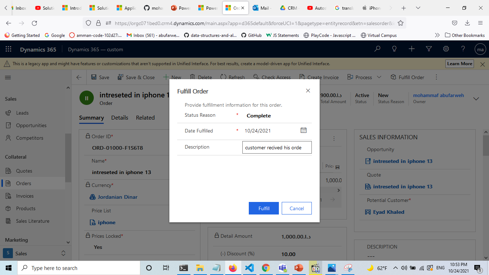

## Assignment 1:

- Perform Sales life cycle, starting from lead until invoice is generated.
- The following points are required in the assignment.

- Screenshot of each stage until the invoice.
- Description under each screenshot with the business logic of the current stage (Ex: In this stage I captured this lead through his business card.)
- On each stage(lead ,opportunity, etc..) there should be activities included as we did in the session.

- Extra (not mandatory) :
- Create a pricelist with your products instead of using the out of box & use it in your sales cycle.

### Solution :

#### 1. Leads

1.  create new lead ,press in new in action bar 

2.  fill all the feilds in contact then save

3. make first activity ,but we have elite phone as competitor , I will call him again

4. make task to ask my team leader about price

5. add elite phone as competitor

6. call him again ,price is done

7. click in qualify to go to next stage (Opportunities)

#### 2.Opportunities

- in product line items we can select price list the the product ,you can make new price list :

- add product to the price list

 
 

- price list done 

- we are ready to make quotes and send it

- make disscount 10 percent

- make quotes then activate quote

-Export to pdf then send it bt customer email

### 3. create order

- crete the order and the stautes won

### 4. create invoice 

- press in create invoice in action bar 

- then invoice paid 

- orders 

- then fulfill order 

#### The End

