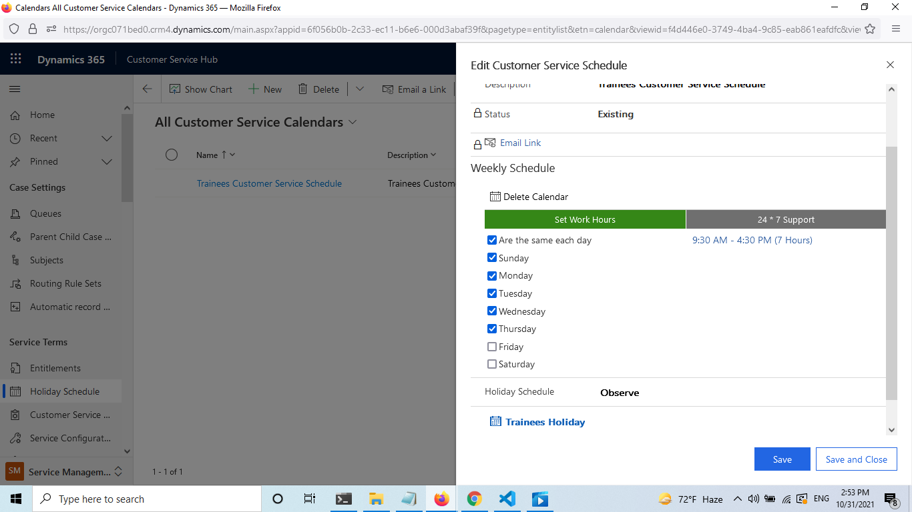

# Service 

1. Settings -->Advanced Settings-->service mangment 

- As you see you can set :
1. Queue
2. Routing Rules Sets
3. Subjects 
4. SLA
5. Holiday Schedule
6. Customer Service Schedule
7. Entitlements
8. Service Configuration Settings

2. Set up new Queue :

#### Notes

- Private queues: Create with limited set of members to help those members easily view the queue items in that queue. Private queues streamline queue items for the members of that queue only and help to remove clutter from other user’s views.

- If you’re creating a private queue, you’ll need to add members to this queue manually. In the Members section, select the Add button + to add members to the queue. Only these members will be able to work on the items in this queue
- Public queues: Create to let everyone in the organization view the queue and all the items it contains.

- In the EMAIL SETTINGS section, in the Convert to email activities dropdown list, select a value depending on the type of messages that you want to track as activities.

3. Set up Holiday Schedule:

- create a Trainees Holiday Schedule .

- Add Holidays .

4. Set up Customer Service Schedule :

- Create Customer Service Schedule

- Set Work Hours

- Edit Customer Service Schedule
- Observe my  Holiday Schedule

5. Service Level Agreements (SLA)

- create new SLA

- SLA Items

- Edit Emails 

