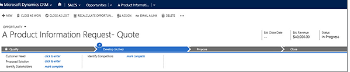

# Basic CRM Terms

**### 1. Entity**

- An entity is simply a module, or section, comprising a key grouping of data

#### **Entity ownership**

- There are four different types of entity ownership. When you create a custom entity the only options are user or team owned or organization-owned, but you should be aware that other entities have different ownership types.

**- Business-owned** 	There are several business-owned system entities. These include Business Unit, Calendar, Team, Security Role, and User.

**- None** 	There are many system entities that don’t have an owner, but most of these aren’t visible in the solution explorer. These mostly consist of intersect entities created to support Many-to-Many relationships or where access to the record is controlled by a parent record. For example, Opportunity Product records must be accessed through a user or team owned Opportunity record.

**- Organization-owned** 	There are organization-owned system entities. These include Article, Article Template, Competitor, Currency, and Web Resource.

**- User or Team Owned** 	There are user or team owned system entities. Because these records are owned by a user or team, they’re connected to a business unit and specific security roles for the business unit. Therefore, these entities participate in role-based security.

#### **Activity entities**

- **Appointment** 	Commitment representing a time interval with start/end times and duration. 	
- **Campaign Response** 	Response from an existing or a potential new customer for a campaign. 	
- **Email** 	Activity that is delivered using email protocols. 	
- **Fax** 	Activity that tracks call outcome and number of pages for a fax and optionally stores an electronic copy of the document. 	
- **Letter** 	Activity that tracks the delivery of a letter. The activity can contain the electronic copy of the letter. 	
- **Phone Call** 	Activity to track a telephone call. 	
- **Recurring Appointment** 	The master appointment of a recurring appointment series. 	
- **Service Activity**	Activity offered by the organization to satisfy its customer's needs. Each service activity includes date, time, duration, and required resources. 	
- **Task** 	Generic activity representing work needed to be done. 	
- **Campaign Activity** 	Task performed, or to be performed, by a user for planning or running a campaign. 	
- **Case Resolution** 	Special type of activity that includes description of the resolution, billing status, and the duration of the case. 	
- **Opportunity Close** 	Activity created automatically when an opportunity is closed, containing information such as the description of the closing and actual revenue. 	
- **Order Close** 	Activity generated automatically when an order is closed. 	
- **Quick Campaign** 	System operation used to perform lengthy and asynchronous operations on large data sets, such as distributing a campaign activity or quick campaign. 	
- **Quote Close** 	Activity generated when a quote is closed. 	

### 2. Dashboards

- A dashboard in CRM is very much like the dashboard in your car: it is a live snapshot of what’s happening at that moment. It can be set up to show whatever key performance indicators (KPI’s) matter most to you. You can have multiple dashboards in CRM, each comprised of multiple charts, views, and other components. Below is an example of a Sales Activity Dashboard that a sales manager might want to use. It shows the sales pipeline, goals vs. percentage achieved, leads by source, top opportunities, and top customers.

### 3. Field

- A field is simply a “box” into which you enter one piece of data. Below we can see three fields contain data: account name, parent account, and phone number.

### 4. Record

- A record is a collection of related fields. Below are three records within the Contacts entity: Bob Dixon, Jay Madiha, and Ted Best. Note that each record comprises many fields, including Job Title, Address, etc.  In CRM, you can click on any record to open it and see all the information (fields) it contain

### 5. Forms

- A form is the interface where users interact with CRM, add data, and move things around. Below is the form visible when the account Lern Inc is opened. Note a form may show much of the information in any given record, but not necessarily all of it.

### 6. Views

- Views are the ways to sort and see information. Below you can see a drop-down menu of available views within the Opportunities entity

### 7. Process bar

The entities in Dynamics CRM offer the option of using what’s known as a process bar

