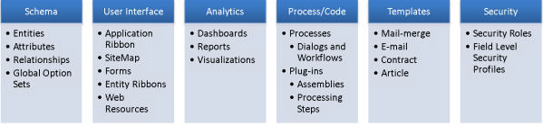

# Solution concepts

- Solutions are the mechanism for implementing ALM in Power Apps and Power Automate.

### Application lifecycle management (ALM)

- ALM is the lifecycle management of applications, which includes governance, development, and maintenance. Moreover, it includes these disciplines: requirements management, software architecture, development, testing, maintenance, change management, continuous integration, project management, deployment, and release management. ALM tools provide a standardized system for communication and collaboration between software development teams and related departments, such as test and operations. These tools can also automate the process of software development and delivery. To that end, ALM combines the disciplines concerned with all aspects of the process to achieve the goal of driving efficiency through predictable and repeatable software delivery.

1. **Governance** includes requirements management, resource management, data security, user access, change tracking, review, audit, deployment control, and rollback.

1. **Application development** includes identifying current problems, and planning, design, building, and testing the application. This area includes traditional developer and app maker roles.

1. **Maintenance** includes deployment of the app and maintenance of optional and dependent technologies.

### ALM for Power Apps, Power Automate, Power Virtual Agents, and Dataverse

- **Dataverse** in Microsoft Power Platform lets you securely store and manage data that's used by business applications.
- To use the features and tools available for ALM, all environments that participate in ALM must include a Dataverse database.
- **Solutions are the mechanism for implementing ALM; you use them to distribute components across environments through export and import. A component represents something that you can potentially customize. Anything that can be included in a solution is a component, such as site maps, apps, chatbots, entities, fields, charts, or plug-ins.**

- Dataverse stores all the artifacts, including solutions.

- Source control should be your source of truth for storing and collaborating on your components.

### Solution components

- Solution components are created by using the customization tools or APIs included in Dynamics 365 Customer Engagement (on-premises) and are fully hosted in the application. The following diagram shows the types of solution components.

## Managed and unmanaged solutions

- There are two types of Dynamics 365 Customer Engagement (on-premises) solutions: managed and unmanaged. A managed solution is a completed solution that is intended to be distributed and installed. An unmanaged solution is one that is still under development or isn't intended to be distributed. When the unmanaged solution is complete and you want to distribute it, export it and package it as a managed solution.

**#### Unmanaged solutions**

**- When a solution is unmanaged, you can perform the following actions:**

- Add components.
- Remove components.
- Delete components that allow for deletion.
- Export and import the unmanaged solution.
- Export the solution as a managed solution.

- There are two type of solution in the CRM 2011.

1. Default Solution: This is the customizations of your entire CRM 2011 Organization.

2. Managed Solution: Managed solution is a packed and user can install it on their machine. The benefit of the Managed solution is that, it can be uninstalled if you do not wish to use any of its components any more. The deleting/uninstalling does not impact any other customization in the system. Unlike CRM 4.0 if you want to remove something, then you need to remove the fields from the Form, delete from the entity and remove the buttons from the ISV config. But in the CRM 2011, if you have imported the managed solution then you need to simply delete this solution, it will automatically remove all the components included in the solution like, Forms Customizations, Fields and Buttons.
3. Un-Managed Solution: We generally use the unmanaged solution during the development process. An un-managed solution cannot be deleted like the Managed solution. Changes made by importing the unmanaged solution are permanent and is included as a part of the existing entity customizations. If we have imported the Solution on any system as Un Managed, and if we need to remove the that, then we need to remove the each item manually from CRM. 