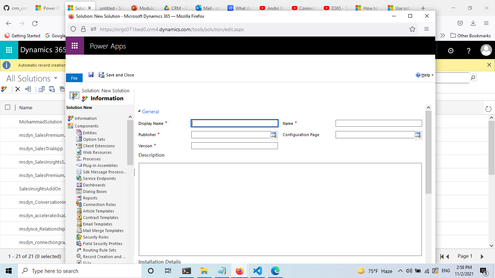

# Create a solution 

# Create a entity 

- Display Name 	This is the singular name for the entity that will be shown in the app.
- Plural Name 	This is the plural name for the entity that will be shown in the app.
- Name 	This field is pre-populated based on the display name you enter. It includes the solution publisher customization prefix.
- Ownership 	You can choose either user or team-owned or organization owned. More information: Entity ownership.

- Each custom entity has a **primary field**. This is defined in the Primary Field tab. This field is used when records for the entity are displayed in a list. The primary field is typically a link that opens the record. This field must be a Single Line of Text field with the format of Text. When creating the entity the only value that can’t be changed later is the Name. By default the Display Name is “Name” and the Name is your solution publisher customizations prefix, an underscore, and “name”. If this isn’t what you want, change this before you create the entity. After you save the entity, you can’t edit the primary field values from the Primary Field tab for the entity. You must locate this field in the entity fields. You’ll be able to edit it there like any other single line of text field.

