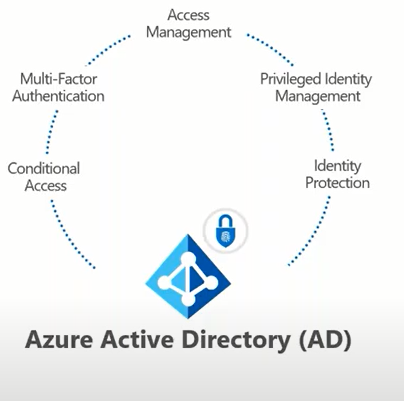

# Asynchronous vs. Synchronous :

###  Asynchronous :

- **asynchronous** operations, you can move to another task before the previous one finishes. This way, with asynchronous programming you’re able to deal with multiple requests simultaneously, thus completing more tasks in a much shorter period of time.   

- You should only use it if you’re dealing with **independent** tasks.

###  synchronous :

- synchronous operations tasks are performed one at a time and only when one is completed, the following is unblocked. In other words, you need to wait for a task to finish to move to the next one. 

# SOAP vs REST

-  SOAP only works with XML formats whereas REST work with plain text, XML, HTML and JSON.
- REST is an Architectural , SOAP is a protocol.

| Tables   |       REST   |  SOAP |
|----------|:-------------:|------:|
| Statelessness |   If there is no need to maintain a state of information from one request to another then REST should be used. | If you need a proper information flow wherein some information from one request needs to flow into another then SOAP is more suited for that purpose. We can take the example of any online purchasing site |
| Caching  |    cache a lot of requests  |  less|
| Ease of coding  |  far easier|    more harder than REST   |
| security  | WS security with ssl support ,built in asset compliance,vary secure |    https ,ssl |
| recomended sectors used  | enterprice app high security app ,distributed enviroments financial services ,payment, telecommunications   |    public api web services ,mobile app services and social net work |

# Azure 

- At its core, Azure is a public cloud computing platform—with solutions including Infrastructure as a Service (IaaS), Platform as a Service (PaaS), and Software as a Service (SaaS) that can be used for services such as analytics, virtual computing, storage, networking, and much more. It can be used to replace or supplement your on-premise servers. 

- Azure is a fast, flexible, and affordable platform, and its pricing and capabilities make it the best public cloud offering on the market. Now let’s take a look at how to put it to work for you.

- https://www.youtube.com/watch?v=3Arj5zlUPG4

- Microsoft provides five different customer support options for Azure:

1. Basic
2. Developer
3. Standard
4. Professional Direct
5. Premier

- Microsoft sorts Azure cloud services into nearly two dozen categories, including:

1. Compute.
2. Mobile. 
3. Web. 
4. Storage. 
5. Analytics.
6. Networking.
7. Media and content delivery network (CDN).
8. Integration. 
9. Identity. 
10. Internet of things. 
11. DevOps. 
12. Development.
13. Security. 
14. Artificial intelligence (AI) and machine learning.
15. Containers.
16. Databases. 
17. Migration. 
18. Management and governance. 
19. Mixed reality. 
20. Blockchain. 

# What is Azure Active Directory (AAD)

- Purpose

1. Centralized administration for cloud services
1. Services (e.g. Exchange) can leverage for email services configuration
1. Hybrid scenarios supported via Azure AD Connect connecting to local Active Directory
    Use your corporate credentials/passwords

- Deployment

1. Cloud Service

- Limitations

1. Lack of IT protection without AAD P1 and P2 licensing
1. Device bases security requires EM+S licensing for Intune

 
 

 
 
 

# Security roles
- A security role defines how different users, such as salespeople, access different types of records. To control access to data, you can modify existing security roles, create new security roles, or change which security roles are assigned to each user. 

### Access level for that privilege

1. **Global-full green circle**. This access level gives a user access to all records in the organization, regardless of the business unit hierarchical level that the environment or the user belongs to. Users who have Global access automatically have Deep, Local, and Basic access, also.

- Because this access level gives access to information throughout the organization, it should be restricted to match the organization's data security plan. This level of access is usually reserved for managers with authority over the organization.

- The application refers to this access level as Organization.

2. **Deep half green circle**. This access level gives a user access to records in the user's business unit and all business units subordinate to the user's business unit.

- Users who have Deep access automatically have Local and Basic access, also.

- Because this access level gives access to information throughout the business unit and subordinate business units, it should be restricted to match the organization's data security plan. This level of access is usually reserved for managers with authority over the business units.

- The application refers to this access level as Parent: Child Business Units.

3.  **local half yellow circle**.	Local. This access level gives a user access to records in the user's business unit.

- Users who have Local access automatically have Basic access, also.

- Because this access level gives access to information throughout the business unit, it should be restricted to match the organization's data security plan. This level of access is usually reserved for managers with authority over the business unit.

- The application refers to this access level as Business Unit.

4. **Basic quarter yallow circle**. This access level gives a user access to records that the user owns, objects that are shared with the organization, objects that are shared with the user, and objects that are shared with a team that the user is a member of.

- This is the typical level of access for sales and service representatives.

- The application refers to this access level as User.

5. **none red circle**. No access is allowed.

### Record-level privileges

1. **Create**	Required to make a new record. Which records can be created depends on the access level of the permission defined in your security role.
1. **Read**	Required to open a record to view the contents. Which records can be read depends on the access level of the permission defined in your security role.
1. **Write**	Required to make changes to a record. Which records can be changed depends on the access level of the permission defined in your security role.
1. **Delete**	Required to permanently remove a record. Which records can be deleted depends on the access level of the permission defined in your security role.
1. **Append**	Required to associate the current record with another record. For example, a note can be attached to an opportunity if the user has Append rights on the note. The records that can be appended depend on the access level of the permission defined in your security role.
In case of many-to-many relationships, you must have Append privilege for both tables being associated or disassociated.
1. **Append To**	Required to associate a record with the current record. For example, if a user has Append To rights on an opportunity, the user can add a note to the opportunity. The records that can be appended to depend on the access level of the permission defined in your security role.
1. **Assign**	Required to give ownership of a record to another user. Which records can be assigned depends on the access level of the permission defined in your security role.
1. **Share**	Required to give access to a record to another user while keeping your own access. Which records can be shared depends on the access level of the permission defined in your security role.

### minimum privileges required to login microsoft dynamics 365 

- https://www.inogic.com/blog/2016/11/minimum-privileges-required-to-login-microsoft-dynamics-365/

### Append Vs AppendTo

- ‘Append’ and ‘Append To’ privileges works together in CRM. ‘Append To’ allows other entities to get attached with it. ‘Append’ privilege will allow the entity to attach the records of an entity which has ‘Append To’ privilege.

- Ex: Generally, we attach notes to an entity (Account). To do this Note should have “Append” privilege and Accounts should have “Append To” privileges.

- Let say Entity1 and Entity2 has 1:N relation. Entity1 should have Append To and Entity2 should have Append permission to relate both the entities records with lookup.

### Share Vs Assign

- share:
On sharing the record, selected permission given to new user on that record. Here, ownership of the record remain same.

- asign:
On Assigning record, Ownership will be transferred to new user

### System Administrator and System Customizer security roles

| System Administrator   |       System Customizer      |
|----------|:-------------:|
| Has full permission to customize the system|  Has full permission to customize the system| 
| Can view all data in the system |    Can only view records for system entities that they create   |  

- The difference between the System Administrator and System Customizer security roles is that a system administrator has read privileges on most records in the system and can see everything. Assign the System Customizer role to someone who needs to perform customization tasks but shouldn’t see any data in the system entities. However, testing is an important part of customizing the system. If system customizers can’t see any data, they will need to create records to test their customizations. By default, system customizers have full access to custom entities. If you want to have the same limitations that exist for system entities, you’ll need to adjust the system customizer security role so that the access level is User rather than Organization for custom entities.

### Database privileges

| System Administrator   |       System Customizer      |
|----------|:-------------:|
| Create, Read, Write, Delete, Customizations, Security Roles|  Create (self), Read (self), Write (self), Delete (self), Customizations| 
| Has full permission to customize or administer the environment, including creating, modifying, and assigning security roles. Can view all data in the environment|    Has full permission to customize the environment. However, users with this role can only view records for environment entities that they create.    |  

# Types of teams

- A team belongs to one business unit, but it can include users from other business units. A user can be associated with more than one team. An owner team owns records and has security roles assigned to the team.

**- Owner team:** An owner team owns records and has security roles assigned to the team. A user's privileges can come from their individual security roles, those of the teams that they're part of or the ones they inherit. A team has full access rights on the records that the team owns. Team members are added manually to the owner team.

**- Access team:** An access team doesn't own records and doesn't have security roles assigned to the team. The team members have privileges defined by their individual security roles and by roles from the teams they're members of. These members share records with an access team, and the t