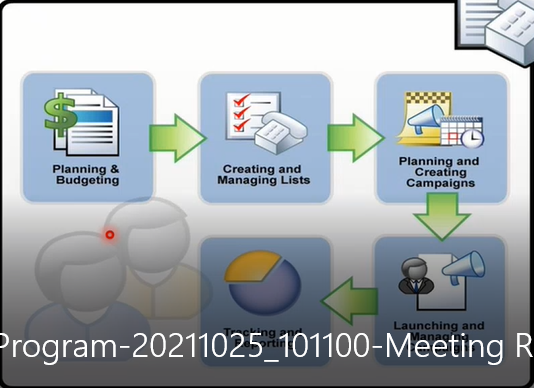

# Marketing 

### 1. marketing campaign

Advertising ,A marketing campaign is a set of strategies used by businesses to achieve specific goals

- Components of successful marketing campaigns:

✔️ A goal: Do you want to sell a new product or let your current customers know that part of your service has changed? These are examples of different goals. Once you decide what you want the marketing campaign to achieve, it's easier to create a singular goal to strive for.

✔️ An offer: Are you offering a webinar? A free product trial? Your offer will pave the way your marketing campaign is communicated to your audience.

✔️ An audience: Are you advertising to current customers? Or are you trying to attract new ones? The target audience for your marketing campaign will impact everything from its goal to its messaging.

✔️ A clear message: Are you selling? Creating brand awareness? Giving away some freebies? Deciding on a clear message and sticking to it throughout the marketing campaign is essential to its success.

### 2. segmentation markting list

- Your marketing list is the core of running a successful marketing campaign. It can include any one type of customer record, such as leads, accounts, or contacts

- A marketing list in CRM is generally a subset of your contacts (or leads) with whom you want to communicate. The members of the list likely have something in common – perhaps they are all working at non-profits, or maybe they are small to medium business owners in a tri-state area

**- Static vs Dynamic**

- A Static marketing list is a snapshot in time. You add the contacts you want in that marketing list depending on certain criteria…and that was it. If a new contact is added to the CRM database you can manually add them to the marketing list, or if the marketing list is no longer relevant to a contact you can manually remove them.

- Dynamic marketing lists removes the manual element. You can create a query (e.g. all customers where their country equals Ireland). This means that any contacts with “Country = Ireland” will be added to the list. As you add new contacts to the CRM database, they will automatically be added to the marketing list if they live in Ireland. If a contact moves and the Country field in the contact card is updated, then they will be automatically removed from the marketing list.

### 3. planning activities

- calls, emails , ..

### 4. Target product 

- select and explain the product 

### 6. sales lit

- upload documents 

### 7. campaign avtivities 

### 8. campaign response 

### 9. campaign performance 

- reports 
