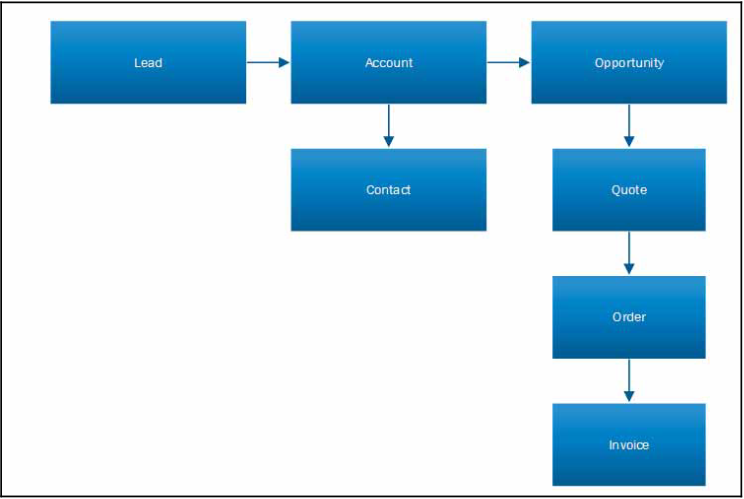
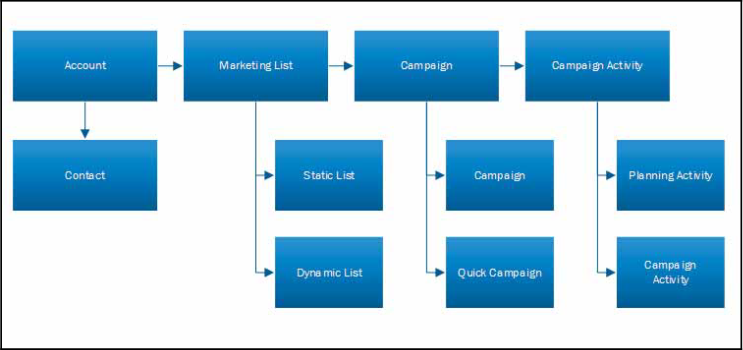
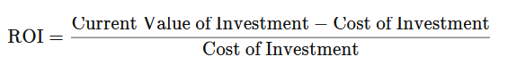
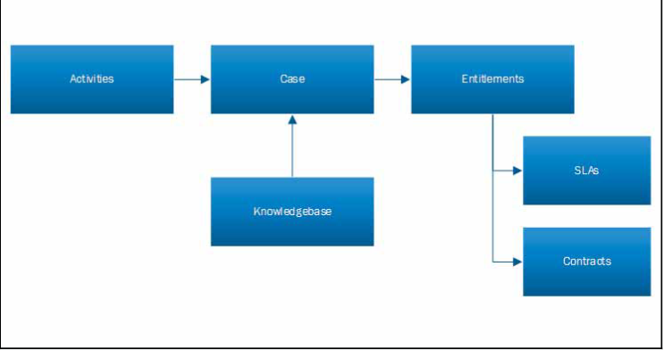

# Chapter One

### History of Dynamics CRM

- Microsoft Dynamics CRM was first introduced in 2003 as Microsoft CRM 1.0. It had far
fewer functionalities, which focused on the Sales and Service modules. Organizations faced
some difficulties as the customization capabilities were limited and the business process
were harder to map with the processes in the system. This product targeted the
organizations working with relationship management.

| Version      | Description |
| ----------- | ----------- |
| 3.0 in 2005      | The UI was enhanced and the Marketing module was introduced with this version. The customization capabilities were also increased       |
| 4.0 in 2007 (Titan)   |  improved security features, data importing functionalities, mail merge, and support for operating systems such as Windows 2008 and SQL 2008.  This version provided options for selecting multiple currencies and choice of base languages. Plugins and workflows were introduced with this version,      |
| 2011   | Features such as charts and dashboards were introduced with this version, which allowed the users to visualize the data in a pictorial format. It provided a 360-degree view of customer profile, which enhanced productivity. Solutions were also introduced in this version        |
| 2013   |  it was possible to run Microsoft Dynamics CRM on any browser from a tablet device powered by Windows 8 or iOS and any smartphones running Windows Phone 8, Android, or IOS. The popups were also reduced, which was a significant change. Business rules and real-time workflows were introduced in Microsoft Dynamics 2013. This reduced the need to embed code in plugins, thus reducing the customization effort required on the platform        |
| 2014   | more features, such as Rollup and Calculated fields, one-note integration, themes, pause and resume SLAs, and so on, were introduced. Business rules were enhanced more, and it was now possible to embed more complex logic in the conditions. Business Process Flows didn't have in-built features, which prevented the movement of stage if some of the mandatory steps were not completed.        |
| 2016    | 2016 was released with features such as Word and Excel templates. With this version, it was possible to integrate CRM with other products such as SharePoint, Azure, and Power BI, which provided better cross-selling.        |

### Sales module 

- **Entities**

- Account: Account stores the information related to your customers, which can be a company or an organization. It can also contain records of stakeholders, vendors, business partners, or other organizations you interact with. 
- Contact: This stores the information related to the people or individuals that are
generally your customers or contacts of customers. Contacts are mostly related to
a customer. Sometimes, a contact is not linked to any customer. In such cases,
they are not related to any account.
History of Dynamics CRM Chapter 1[9 ]

- Lead: Leads are the potential customers generated from multiple sources, such as
entering them manually, from company website, mails, or from other social
media. If the lead is qualified, then they are converted to an opportunity.

- Opportunity: When your customer responds or shows some interest, then your
Lead is converted to an Opportunity. An Opportunity can be won or lost

### Sales life cycle

- Generally, the sales life cycle starts with Lead generation. A lead is your potential customer.
When an individual or a company shows any interest in your product/service and provides
some details for further communication, then it is considered a lead:

- The salesperson either manually enters the details of the lead into the CRM or captures the details through mails, websites, phone calls, campaigns, and so on. It requires a lead name (first name and last name) and a topic that describes the lead.

- After lead creation, the salesperson does multiple activities to convert it to a customer. This
can be done in form of appointments, phone calls, and emails to gather more information
about the customer. If the customer gives a positive response, then Lead is qualified to an
Opportunity. A contact and an account record is created after lead qualification. If the lead
is disqualified, the sales process ends.
- Once the lead is qualified, the salesperson gives quotes to the customer. Quotes can be
revised multiple times until the customer agrees. Once the customer agrees with the quote,
the opportunity is won; otherwise, the opportunity is lost and the sales process ends.
After winning an opportunity, an order is placed and an invoice is created after the order is
delivered to the customer. 

### Marketing

### Marketing life cycle

- Marketing List is made up of records in accounts, contacts, and leads. One can market new products to the existing customers or contacts and other references

### Marketing list
- The responses from the campaigns are recorded and new leads are generated. After lead
generation, marketing executives can pitch your product or service to those leads.
Marketing listMarketing in Dynamics CRM generally starts with having marketing lists on place. A
marketing list is a collection of accounts, contacts, and leads. Marketing lists are created to
distribute a campaign.

- Marketing lists can be static or dynamic:

 1. Static list: In a static marketing list, members are added manually.
 2. Dynamic list: In a dynamic marketing List, members in the list are added using an advanced find. When a new record is created that meets the criteria in the query, then it is also added to the marketing list.

### Campaigns

- Campaigns are a part of the Marketing module in CRM. Campaigns are conducted for the
promotion of products/services provided by the business. It is a coordinated series of steps
that includes the promotion of your products/services, which will eventually increase your
sell. It is a way of reaching out to customers, building your brand, introducing your product
in the market, and having a positive impact on the customers and leads.
Microsoft Dynamics 365 makes things easier as it provides you end-to-end help, from 
planning different activities to accounting your **Return on Investment (ROI)** from each
campaign

-  **What Is Return on Investment (ROI)?**
- Return on investment (ROI) is a performance measure used to evaluate the efficiency or profitability of an investment or compare the efficiency of a number of different investments. ROI tries to directly measure the amount of return on a particular investment, relative to the investment’s cost. 

### Service
 
- The Service module of Microsoft Dynamics CRM helps you in tracking all the activities 
performed to provide customer service in your organization. The entities that store the data
and information related to services are **Case**, Knowledge Base, and Contracts.
Once the customer becomes a part of the system, your organization needs to provide
support for the product or service you sold. Therefore, the customer may make a phone call
to raise an issue regarding the product. The customer service agents will come forward and
help the customer with resolving the case. The Service module of Microsoft Dynamics CRM
supports the tasks that are necessary for service management.

### Activities

- Activities help you in keeping track of the interactions made with the customers for
resolving a case. To resolve a case, a customer service representative may perform multiple
activities to converse with the customer. In Microsoft Dynamics CRM, the service activities
are categorized into the following:

1. Phone call
2. Task
3. Email
4. Appointments

- You can convert an email or a phone call to a case.

### Case
- The Case entity, which is also called ticket in Microsoft Dynamics CRM, pertains to the
issues and problems of customers. Therefore, whenever a customer raises an issue, the
customer service agent will record it in the form of a case. These cases are routed to service
agents in a queue. A case is tracked until it gets resolved.
Before assigning the case, you need to check the customer's entitlements. Through
entitlements, it can be known whether the customer is eligible for a service.
You can also check if there is an existing case in the system; it can then be reopened.

### Entitlements

- Entitlements are the terms and conditions of the support to be provided. The customer's
support agreement depends on the products and services bought by them. The support
level may vary according to the type and cost of the product. Therefore, the information
stored in entitlements helps the agent to verify the type and eligibility of service to the
customer.
An SLA is associated when an entitlement is added to a case.

### SLAs
- SLAs are service level agreements defined for each customer. They define the Key
Performance Indicators (KPIs) to attain the service level. KPIs help with warnings to
provide support in a timely manner.
Microsoft Dynamics CRM helps you create two different types of SLAs: standard and
enhanced. Standard SLAs can only be used with the case entity, while enhanced SLAs are
supported by multiple entities in CRM. The following are the entities that support enhanced
SLAs:

1. Account
2. Contact
3. Order
4. Invoice
5. Quote
6. Opportunity
7. Lead