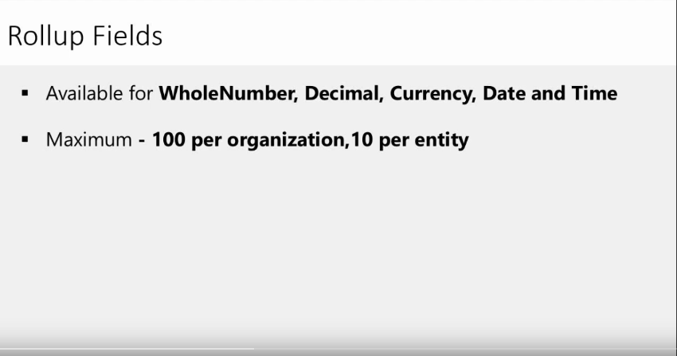
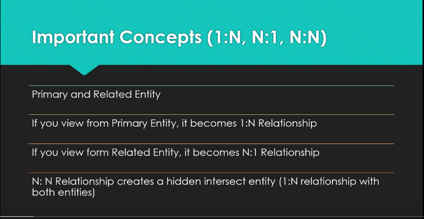
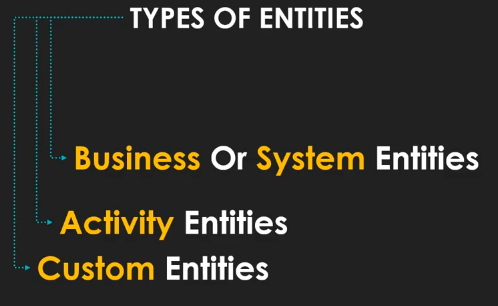

# Working with the XRM Framework

- **Out-of-box** features mean the components that come packaged with Dynamics CRM 2016, right after an instance is set up. Out-of-box Dynamics CRM 2016 consists of three modules: Sales, Service, and Marketing. 

###  Rollup fields

- ***What operations can the Rollup fields do?Rollup fields can be created for the following operations:***

- SUM: This calculates the sum of a set of related record fields and rolls up to a
parent entity field

- COUNT: This counts the related records and rolls up to a parent entity field
- MIN: This gets the minimum value in a set of related record fields and rolls up to
a parent entity field
- MAX: This gets the maximum value in a set of related record fields and rolls up
to a parent entity field
- AVG: This gets the average value in a set of related record fields and rolls up to a
parent entity field

- ***The following are some of the limitations of Rollup fields:***

1. Rollups are only supported for 1:N relationships and not for N:N relationships
2. The maximum number of Rollup fields allowed in any CRM organization is 100
3. The maximum number or Rollup fields allowed in one CRM entity is 10
4. Creating Rollup fields over a Rollup field is not allowed
5. A workflow cannot be triggered on Rollup field updates

***- The following are some limitations of the Calculated fields:***
- A Calculated field cannot refer to itself in the formula.
We can configure a Calculated field such that its value is determined by another
Calculated field. However, the maximum level of this dependency is five.
Duplicate detection rules are not triggered on Calculated fields.

### Calculated Vs Roll Up Field
- [Calculated Vs Roll Up Field](https://community.dynamics.com/crm/b/passiondynamics/posts/calculated-vs-roll-up-field)

### Relationships

- ***Relationship behavior***: This defines how the child entities will be impacted if
any of the following events are executed on the parent record:
1. **Assign**: When the parent record is assigned to another user or a
team
2. **Reparent**: When the associated child record is assigned to another
parent record
3. **Share**: When the parent record is shared
4. **Delete**: When the parent record is deleted
5. **Unshare**: When the parent record is removed from sharing with
the child record
6. **Merge**: When the parent record is merged with another record
7. **Rollup view**: This option is available only when the parent is
Account, Contact, or Opportunity, and it is related to the Rollup of
the activities field on the related recordzz

- [CRM Relationship Behavior](https://www.inogic.com/blog/2009/12/crm-relationship-behavior/)

- [CRM Relationship](https://www.youtube.com/watch?v=gQxgI27T8O0)

### types of entities 
 

