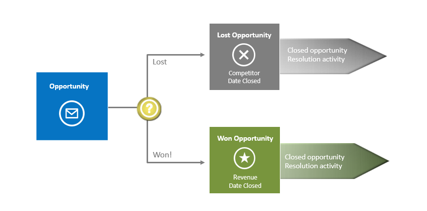
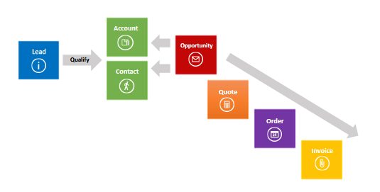
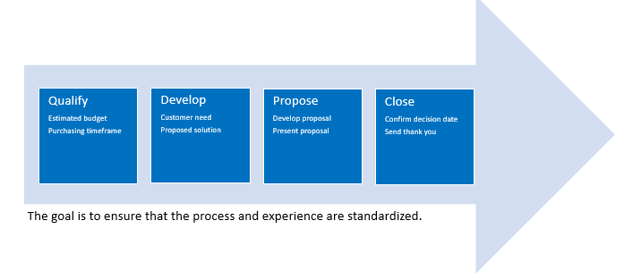
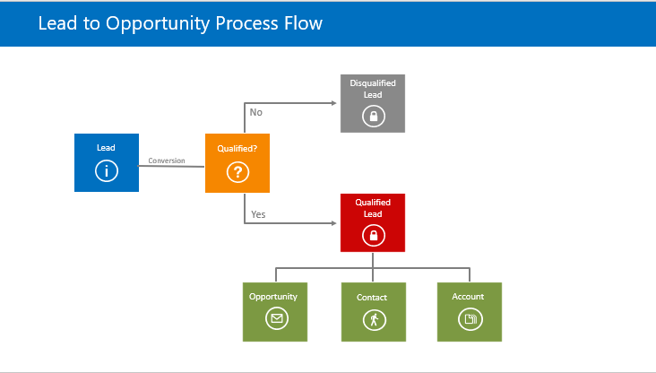

#  Sales Management​

### Customer Scenarios
- Existing Customer ​

- New Customer ​

- Prospects

### Customers

1. Account​
  - Organization/Company​
  - Vendors​
  - Partners​
  - Distributors​
  - Resellers​

2. Contact​
  - Person​

3. Customers​
  - People​
  - Organizations serviced

### 1. Leads
1. Represents Potential​
- Potential Sale​
- Potential Customer​

2. Qualification​
- Determine Viability​
- Should be considered temporary

### 2.Opportunities
- Represents a potential sale​

- Can be created from qualified leads​
- Must be attached to an Account or Contact record​
- Status values​
   - Open​
   - Won​
   - Lost

### Quotes, Orders, Invoices

- Quote​
  - Formal offer​
- Order​
   - Confirmed request​
- Invoice​
   - Billed order
 

 

 
 

 
 

