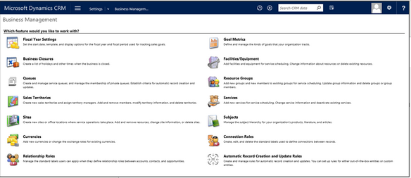
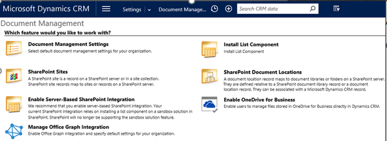
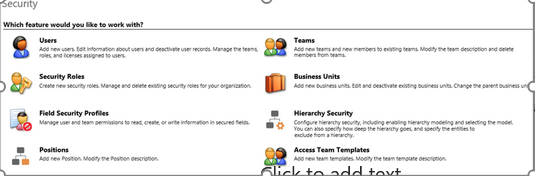

# Configuring CRM​

- What is CRM configuration?
- Utilizing configuration to operate and manage a CRM is indispensable. Configuration is practically the structure and administration of the system In Microsoft Dynamics 365, configuration is essential for improving the UI design, field settings, security, business rules, use of options and features, and more.
 

- most CRM Settings they are done on each CRM organization

### 1.  Administration Settings​

Each organizations settings are independent,   so if you have multiple organizations you can individually manage each one.   ​
Administration: contains most of your general settings for an organization.  ​
I would call out some specifics here such as the items noted below.  ​

- Auto Numbering is configurable for the 7 supported entities but is not extensible for other entities​
- System Settings -> Synchronization tab is where you can control the default synchronization options between CRM and the Outlook client​
- CRM is multi-language and new languages can be enabled via settings, multi-currency too​
- CRM Online subscriptions can be managed through Subscription Management

### 2. Business Management Settings​

- In the Business Management Area we have Settings that are related to ongoing business operations, procedures and policies that are unique to each organization​

- **Fiscal year settings** can be used as periods for goals​

    - The can also be helpful to managing queries by developers​

- **Queues** provide ways to route and manage work items​

- **Relationship Roles** are being retired in favor of Connections & Connection Roles​

- CRM is a multi-currency application ​

    - Base currency is defined at organization creation​

    - Additional currencies can be added as needed​

    - Currency exchange rate is static unless automated by a developer​

- CRM’s Service scheduling feature can be administrated through here​

- Sites, Facilities/Equipment/Resource Groups, Services, and Business Closures 

### 3. Data Management Settings​
- In the Data Management area, you will find all of you Data settings,  This includes:​
- Duplicate detection rules can be defined to help identify and manage duplicate records – duplicate detection must be enabled​
- Data Maps allow for creating reusable mappings for data import​
- Bulk Delete allows defining jobs that mass delete records based on criteria defined on the job – jobs can be scheduled​
- Sample data can be turned on or off (Enabled by default online)​

* You don’t need to specifically walk them though how to configure duplicate Detection, but it would be a good idea to talk specifically about the rules and such.

- Duplicate Detection​

    - Try to avoid duplicate detection rules that are too generic, they can potentially frustrate users​

    - Duplicate jobs can be scheduled, but only between 7-365 days​
- Data Import​

   - Good for small volume, with reasonably clean data​

   - Multiple files can be uploaded via zip file​

   - Delimited Text, CSV and XML Spreadsheets are supported​

   - Any individual file can’t exceed 8MB in size​

### 4. Document Management Settings​

- CRM have the ability to attach notes, and attachments to individual records, but it is not a document management solution,  it does not provide features like check in/out and versioning,  if these Items are required, you may want to intergrating with another application such as SharePoint, or OneDrive from business.  ​
- List component is provided for SharePoint 2010 and SharePoint 2013 and support for automatic creation of the document library.​

    - Server Side integration can be enabled for organizations that are using SharePoint Online (replaces the list component).​

- Structure can be based on entity or based on Account/Contact​

- OneDrive for Business Integration can also be enabled for entities (Server Side only)​

- Office Graph Integration

### 5. Collaboration Settings

- Much like Document Management, you may find that CRM’s out of the box activity, and system posts don’t provide your organization with the true collobration functions that you need.  You have the ability to replace the OOB Activity feeds on forms with a Yammer Subscription.  ​

- Activity feed solution is now part of the core CRM system solutions​

- Post configuration and rules control what and when things are automatically posted​

- Developers can interact with the activity data using the CRM API or if Yammer is enabled they can choose to use the full Yammer API as well​

- Once Yammer is enabled there is not an option to go back to activity feeds​

# Security 

- Admins can manage Users, Teams, Business Units, and Security Roles​

- More complex security needs can be met by defining Hierarchy Security, and Positions

- CRM’s Security area, is where you will configure CRM security,  over the course of the rest of this module and the next module we will walk you though each of the security items that you can define.  ​
 

- Business Units, Users, and Security roles will play a major role in defining who has access to what in the application.  Some of the other items listed can help to solve specific security needs in the application​
- Access Team Templates are used to define specific privileges that can be assigned to users when they are added to an access team (covered in later modules) ​
- Field Security Profiles, define the access that specific user/teams will have to secured fields

### Business Units​
- A business unit is a logical grouping of related business activities. It is the foundation of the security structure in Microsoft Dynamics 365. Each user has to be part of a business unit

**- Provide the framework for your organizational structure:**​
 

- Contain Users, Teams, Security Roles​
- Security (data access including reports)​
   - Define boundaries for Security Role Access Levels.​
- First Business Unit is the “Root” Business Unit.​
   - Created when organization is deployed, with same name as the organization.​
- Child business units linked in a hierarchy.​
  - Similar to an organization chart, but you do not have to replicate your organization chart - create only the business units needed to meet security needs.​
 

### User Management
- Checking user credentials (name and password) is handled by external authentication provider​

   - Active Directory (on premise)​

   - Office 365 (online)​

- After user is signed in, Microsoft Dynamics CRM Security Model is used to control access within the application​
 
- Actual User authentication is done by either Active Directory if you are using CRM On Premise or Office 365 if you are using Dynamics CRM online,  Depending on specific needs it is possible to Authenticate to CRM online using a local Active Directory account,  It would require that your local active directory domain is synced with your Azure Active Directory domain which is used by CRM Online.​
- Regardless of the method you are using once Authenticated to the application,  CRM’s security model (Discussed in more detail in the next module) is used to control access to CRM features and data in the application.  ​
- Each user will first have to exist in AD or O365 and they can then be added as CRM users​
 

​